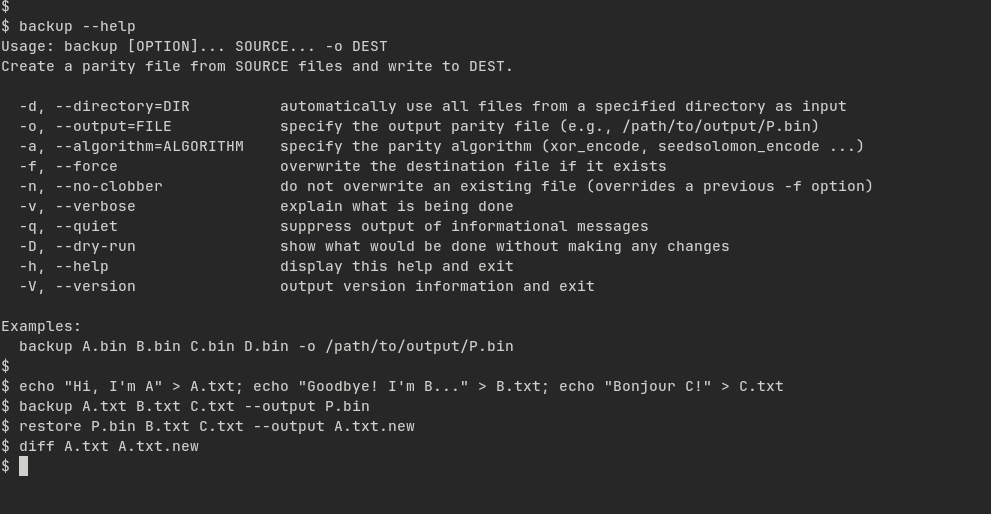
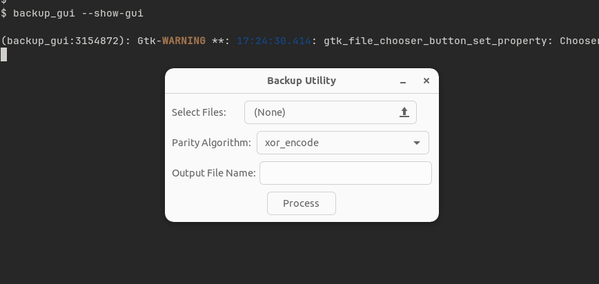

# ParityUtils
A collection of command line utilities for working with Parity error correction code.


And ParityUtils also supports GUI (still under development)


## Simple Use Case
### Generate a Parity File for a bunch of files
```bash
# Generate a parity file
backup A.bin B.bin C.bin D.bin --verbose --output P.bin

# Remove A.bin
rm -f A.bin

# Restore A.bin file from a parity file
restore B.bin C.bin D.bin --verbose --output A.bin
```

### More information
```bash
backup --help
restore --help
```

## Project Structure
The project is structured as follows:
```
ParityUtils/
├── lib/                # Future directory for external libraries (currently not used)
├── gnulib/             # Future directory for GNU libraries (currently not used)
├── README.md           # Project documentation
├── Makefile            # Build configuration file
└── src/                # Source files for the project
    ├── backup.c        # Source code for backup utility
    ├── backup_gui.c    # Source code for backup GUI utility
    ├── common.c        # Common utility functions
    ├── metadata.c      # Metadata handling functions
    ├── parity.c        # Parity encoding/decoding functions
    ├── parity_core.c    # Core parity functions
    ├── restore.c       # Source code for restore utility
    ├── system.h        # System definitions and headers
    ├── version.c       # Versioning information
    ├── version.h       # Version header
    ├── backup.h        # Header for backup utility
    ├── backup_gui.h    # Header for backup GUI utility
    ├── common.h        # Header for common functions
    ├── metadata.h      # Header for metadata functions
    ├── parity.h        # Header for parity functions
    ├── parity_core.h    # Header for core parity functions
    └── restore.h       # Header for restore utility
```

## How to build
This project uses developer-predefined Makefile to build the project, but in the near future it will be migrated to [GNU Autotools](https://en.wikipedia.org/wiki/GNU_Autotools) to help generating more precise Makefile and also import [gnulib](https://www.gnu.org/software/gnulib/) to follow the GNU style utilities.

Below example shows how to build the project on Ubuntu 22.04.
### Dependencies
```bash
# Basic build tools
sudo apt install build-essential git make

# SHA256 library
sudo apt install libssl-dev

# For GTK GUI support, install the following packages (Optional)
sudo apt install libgtk-3-dev libcairo2-dev libadwaita-1-dev
```

### Compile
To compile the project, use the following commands:
- To compile the command-line version without GTK GUI:
```bash
make all
```
- To compile the command-line version with GTK GUI:
```bash
make gui
```
- To compile the command-line version with GTK GUI and debug symbols:
```bash
make install
```
- To clean up object files and executables in the src directory:
```
make clean
```

